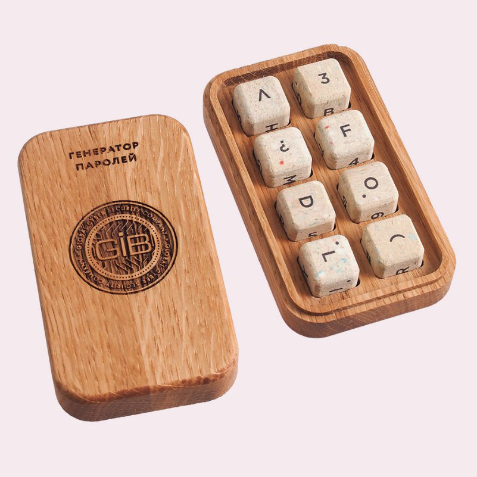

# Генератор паролей с шифрованием на Python



## Описание проекта

Этот проект представляет собой программу для генерации сложных случайных паролей с возможностью их шифрования.

Пользователь может выбрать, сгенерировать пароль автоматически или ввести его вручную.

Программа поддерживает шифрование паролей с использованием алгоритмов **SHA256**, **MD5** и **Base64**.

## Функциональность

- Генерация случайных паролей с настройками:
  - Длина пароля
  - Использование цифр
  - Использование заглавных букв
  - Использование специальных символов
- Проверка надежности пароля (наличие цифр, заглавных букв, специальных символов и длины не менее 8 символов).
- Шифрование пароля с использованием одного из следующих методов:
  - **SHA256**
  - **MD5**
  - **Base64**
- Возможность ввода пароля вручную.

## Необходимые библиотеки
```
random
string
re
hashlib
base64
```

## Пример работы программы:

```
Хотите сгенерировать пароль автоматически? (y/n): y
Введите длину пароля (по умолчанию 12): 16
Использовать цифры? (y/n, по умолчанию y): y
Использовать заглавные буквы? (y/n, по умолчанию y): y
Использовать специальные символы? (y/n, по умолчанию y): y

Ваш пароль: Df8&*1mG$3eL4Qw@

Пароль надежен.

Выберите метод шифрования:
1: SHA256
2: MD5
3: Base64
Введите номер метода шифрования (1, 2 или 3): 1

Зашифрованный пароль (SHA256): 1b2d7b5b4f9a7e2e173dd1e8d0ef83a8e59b1e62b5d7f0b9de8e7e07d5d8cafe
```

**Автор:** Дуплей Максим Игоревич

**Студенты:** Курс программирования на Python в Softline

**Дата:** 19.09.2024

**Версия:** 1.0
